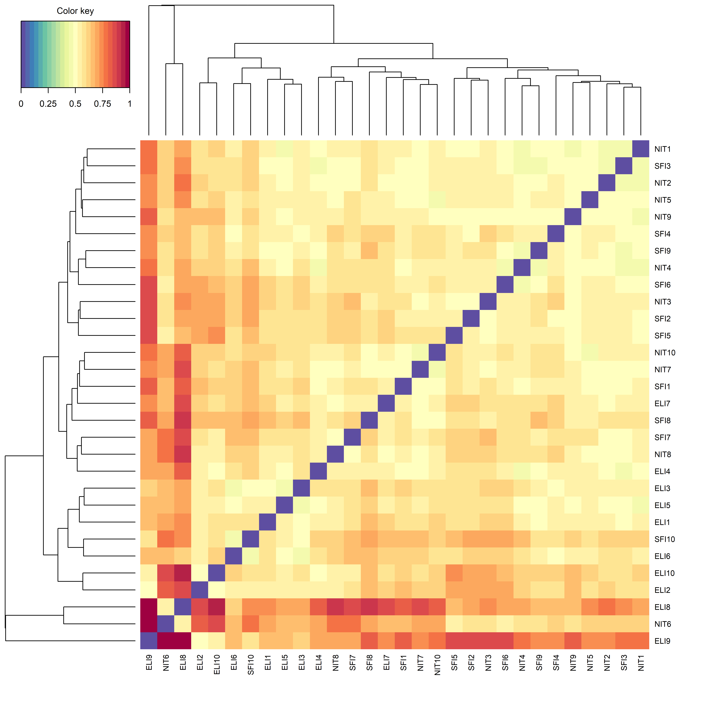
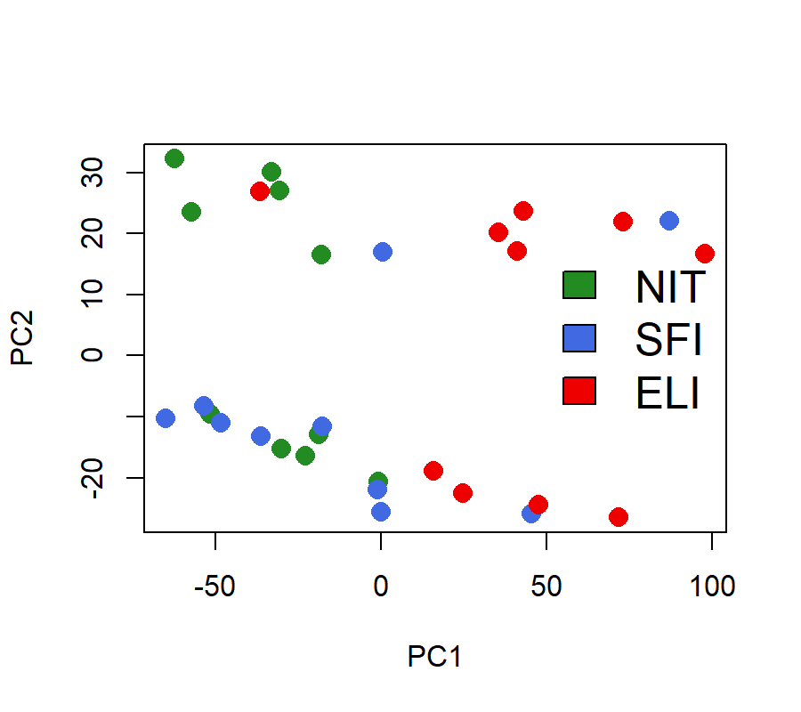
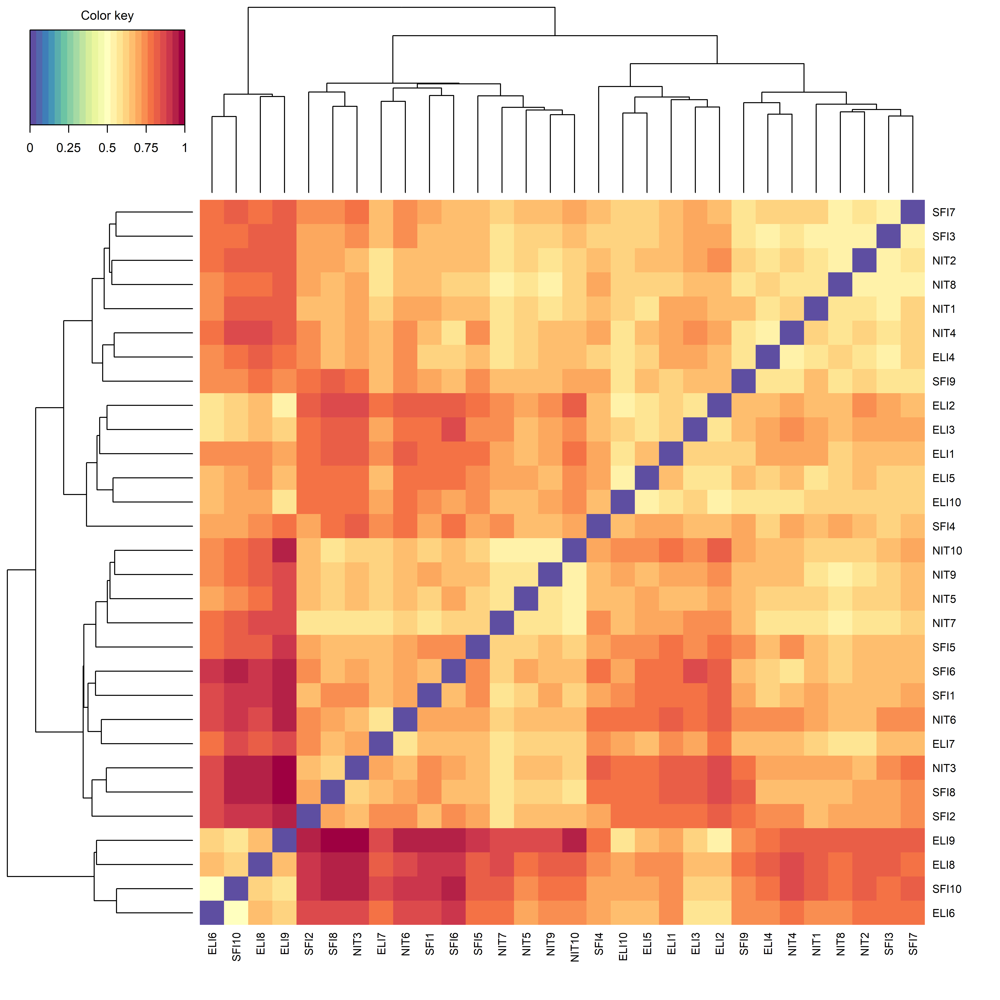
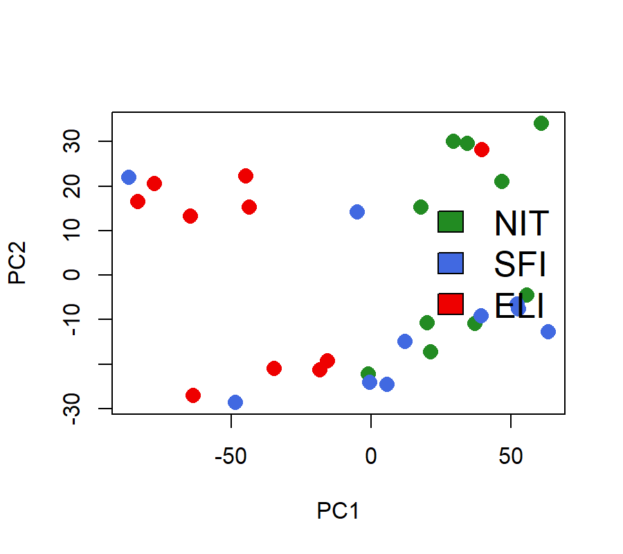

```{r setup, include=FALSE}
knitr::opts_chunk$set(echo = TRUE, warning = FALSE)
```

### Contenidos

#### 1 Introducción y objetivos

#### 2 Materiales y métodos

#### 3 Descripción, localización, selección y preparación de los datos
##### 3.1 Descripción de los datos
##### 3.2 Localización de los archivos
##### 3.3 Selección y de las muestras

#### 4 Exploración de los datos crudos
##### 4.1 Diagrama de cajas o Boxplot
##### 4.2 Mapa de calor o Heatmap
##### 4.3 Análisis de componente principales (PCA)

#### 5 Preprocesado de los datos: filtraje y normalización
##### 5.1 Creación del objeto DESeqDataSet
##### 5.2 Filtraje
##### 5.3 Normalización

#### 6 Exploración de los datos normalizados y evaluación de la calidad
##### 6.1 Diagrama de caja o Boxplot
##### 6.2 Mapa de calor o Heatmap
##### 6.3 Análisis de componentes principales (PCA)

#### 7 Selección de genes diferencialmente expresados
##### 7.1 Selección de genes en una comparación entre dos grupos
##### 7.2 Gráfico MA
##### 7.3 Gráfico volcán o Volcano plot
##### 7.4 Histograma de p-valores
##### 7.5 Agrupamiento de genes

#### 8 Anotación de los resultados

#### 9 Análisis de significación biológica (“Gene Enrichment Analysis”)

#### 10 Resumen de los resultados y discusión

### 1 Introducción y objetivos

En este documento se presenta un análisis de datos de secuenciación de RNA realizado con R y diversos paquetes de Bioconductor.

El objetivo principal de este trabajo es realizar un análisis para encontrar genes diferencialmente expresados entre varios tipos de muestras de la tiroides, clasificadas en tres grupos: tejidos no infiltrados (NIT), pequeños focos inflitrados (SFI) y extensa infiltración linfoide (ELI). Otro objetivo es llevar a cabo un análisis de significación biológica, mediante el cual se pretende averiguar si los genes diferencialmente expresados que hemos identificado están asociados con procesos biológicos.

### 2 Materiales y métodos

El material de partida de este estudio fueron dos archivos .csv conteniendo 1) datos de expresión (RNA-seq) de 292 muestras de tejidos tiroideos pertenecientes a 3 grupos diferentes y 2)  información relativa a cada muestra. 

El procesamiento de los datos y la generación de resultados se llevó a cabo usando R y Rstudio, usando diversos paquetes. Un subconjuto de 30 muestras fue elegido mediante un script. 

La exploración de los datos constó de diagramas de cajas, mapas de calor y análisis de componentes principales de los datos de recuentos transformados en pseudocontajes. Los diagramas de cajas o boxplot se realizaron mediante el paquete ggplot2. Los mapas de calor o heatmaps fueron realizados con los paquetes mixOmics y stats. Los análisis de componentes principales se llevaron a cabo gracias al paquete stats.

El procesamiento de los datos consistión en el filtraje y la normalización de los mismos. El filtraje se realizó mediante un script que descarta los genes en los que la suma de los contajes de todas las muestras es menor que 100. La normalización se usó el método Relative Log Expression (RLE) y se aplicó mediante el paquete DESeq2.

La identificación de genes diferencialmente expresados (DEGs) entre dos grupos de muestras se llevó a cabo usando los paquetes DESeq y DESeq2. Los resultados de la identificación de DEGs se exploraron mediante un gráfico MA, un gráfico volcán, un histograma de p-valores y un mapa de calor de agrupamiento de genes. El gráfico MA fue generado mediante el paquete DESeq2, el gráfico volcán y el histograma de p-valores se realizaron utilizando las funciones básicas de R y para el mapa de calor de agrupamiento de genes se usaron los paquetes mixOmics. Para el mapa de calor de agrupamiento de genes se utilizaron los recuentos rlog transformados mediante el paquete DESeq2.

Los genes fueron anotados utilizando los paquetes AnnotationDbi y org.Hs.eg.db. 

Por último, se llevó a cabo un análisis de significación biológica mediante el paquete goseq. Los resultados de este análisis se visualizaron mediante un gráficos de puntos generado gracias al paquete clusterProfiler.

Los datos utilizados así como un script para reproducir este análisis se encuentran en el siguiente repositorio de github: https://github.com/teguesterillo/PEC2

### 3 Descripción, localización, selección y preparación de los datos

#### 3.1 Descripción de los datos
Este estudio se basa en datos de expresión (RNA-seq) que pertenecen a un análisis del tiroides que compara tres tipos de infiltración:
Not infiltrated tissues (NIT): 236 muestras.
Small focal infiltrates (SFI): 42 muestras.
Extensive lymphoid infiltrates (ELI): 14 muestras.

Los datos fueron obtenidos del repositorio GTEx, que contiene datos de 54 tejidos, y están contenidos en dos archivos: uno llamado “targets.csv”, que contiene toda la información relativa a cada muestra, y otro llamado “count.csv”, con los contajes de cada muestra. 

#### 3.2 Localización de los archivos
Los datos (archivos “targets.csv” y “count.csv”) se encuentran en un subdirectorio de nuestro directorio de trabajo llamado “data”. Los gráficos generados se almacenaron en un directorio llamado "figures".

#### 3.3 Selección y de las muestras
En nuestro estudio trabajamos con 10 muestras de cada tipo seleccionadas aleatoriamente. La selección de las muestras a analizar se hizo mediante un script aplicado al archivo “targets.csv”. El script creó un vector con los nombres de las muestras elegidas (“muestrasAzar”) y un archivo al que llamamos “targets2.csv”, que contiene la información relativa a las 30 muestras seleccionadas.

A continuación, a partir del archivo “counts.csv” creamos un data frame seleccionando las columnas que coinciden con las 30 muestras que hemos elegido previamente. Este data frame, que contiene los contajes del subconjuto elegido de muestras y que llamamos “contajes2”, nos sirvió de base para nuestro estudio. Además, almacenamos los datos del nuevo data frame en un nuevo archivo .csv al que llamamos “counts2.csv”.

```{r echo=FALSE, message=FALSE, results='asis'}
library(knitr)
```

```{r echo=TRUE, results='asis'}
#leemos el archivo targets
muestras <- read.csv(file.path("C:/ADO_PEC2/data/targets.csv"), header = TRUE)
#ordenamos el archivo según la columna Grupo_analisis, que contiene la información sobre el grupo al que pertenece cada muestra (1=NIT, 2=SFI, 3=ELI)
muestras <- muestras[order(muestras$Grupo_analisis),]
#obtenemos los nombres de las muestras
misMuestras <- as.character (muestras$Sample)
#elegimos al azar 10 muestras de cada grupo, teniendo en cuenta que 236 pertenecen al grupo 1, 42 al grupo 2 y 14 al grupo 3
muestrasAzar <- c(sample(misMuestras[1:236], 10), 
                      sample(misMuestras[237:278], 10), 
                      sample(misMuestras[279:292], 10))
#creamos un nuevo data frame a partir de los datos contenidos en el archivo targets pero únicamente con las muestras que hemos seleccionado al azar
muestras2 <-muestras[muestras$Sample %in% muestrasAzar,]
#creamos un vector para renombrar las muestras
nuevosnombres <- c(paste0("NIT", 1:10), 
                   paste0("SFI", 1:10), 
                   paste0("ELI", 1:10))
#anadimos una columna a muestras2 con los nuevos nombres
muestras2 <- cbind(muestras2, nuevosnombres)
#convertimos el data frame "muestras2" en un archivo csv
write.table(muestras2, file.path("C:/ADO_PEC2/data/targets2.csv"), sep=";", row.names=FALSE, quote=FALSE)
#leemos el archivo que contiene los datos de expresión
contajes <- read.csv(file.path("C:/ADO_PEC2/data/counts.csv"), sep=";", row.names = 1 , header = TRUE, check.names = FALSE)
#seleccionamos las 30 muestras que hemos elegido previamente
contajes2 <- subset(contajes, select=muestrasAzar)
#ordenamos las columnas de la tabla de contaje en función de la columna Sample_Name de muestras2
muestras2orden <- as.character (muestras2$Sample)
contajes2 <- contajes2[, muestras2orden]
#ahora las filas de muestras2 (columna Sample_Name) están en el mismo orden que las columnas de contajes2
#convertimos el data frame con los contajes de las 30 muestras en un archivo csv.
write.table(contajes2, file.path("C:/ADO_PEC2/data/counts2.csv"), sep=";", row.names=TRUE, quote=FALSE, col.names = NA)
```

### 4 Exploración de los datos crudos
Comparamos la distribución de valores de expresión entre muestras antes de filtrar y normalizar (datos crudos). Para ello creamos un boxplot y unos gráficos de densidad.

Visualizamos la distribución de los pseudocontajes en cada muestra. Para ello, transformamos los contajes en pseudocontajes, mediante la fórmula: 

y= log2(K+1)

donde K representa el valor del contaje.

#### 4.1 Diagrama de cajas o Boxplot
Los diagramas de cajas nos permiten visualizar la distribución de pseudocontajes en cada muestra.

```{r, echo = F, message=FALSE}
pseudocontajes = log2(contajes2 + 1)
colnames(pseudocontajes)[1:10] = paste0("NIT", 1:10)
colnames(pseudocontajes)[11:20] = paste0("SFI", 1:10)
colnames(pseudocontajes)[21:30] = paste0("ELI", 1:10)
library(reshape2)
pseudocontajesmelt = melt(pseudocontajes)
condition = substr(pseudocontajesmelt$variable, 1, 3)
pseudocontajesmelt = data.frame(pseudocontajesmelt, Condition = substr(pseudocontajesmelt$variable, 1, 3))
library(ggplot2)
ggplot(pseudocontajesmelt, aes(x = variable, y = value, fill = Condition)) + geom_boxplot() + xlab("") + ylab(expression(log[2](count + 1))) + theme(axis.text.x = element_text(angle = 90, vjust = 0.5, hjust = 0))
```

#### 4.2 Mapa de calor o Heatmap
Los mapas de color nos permiten explorer similaridades y disimilaridades entre las muestras. A continuación se muestra un clustering image map (CIM) o heatmap producido a partir de una matriz de distancias entre las muestras. Un dendrograma en el lateral del gráfico nos muestra un agrupamiento jerárquico de las muestras.



Las muestras no aparecen separadas en función del grupo al que pertenecen.

#### 4.3 Análisis de componente principales (PCA)
Realizamos un análisis de componentes principales utilizando los genes con mayor varianza y representamos los dos primeros componentes. Nos permite observar cómo se agrupan las muestras.



La mayoría de muestras ELI se separa del resto en el primer componente principal (PC1), mientras que las muestras SFI y NIT aparecen entremezcladas.

### 5 Preprocesado de los datos: filtraje y normalización
#### 5.1 Creación del objeto DESeqDataSet
Para la identificación de genes diferencialmente expresados utilizamos el paquete DESeq2. Para ello, creamos un objeto de la clase DESeqDataSet, que sirve para almacenar los datos, realizar cálculos intermedios y producir los resultados del análisis de la expresión diferencial. Creamos nuestro DESeqDataSet a partir de la matriz de contaje (contajes2) y la tabla con la información acerca de las muestras (muestras2). Utilizamos los contajes originales y no los pseudocontajes porque los métodos estadísticos que utilizaremos para detectar genes diferencialmente expresados se basan en contajes originales (y no transformados). En cualquier caso, la función DESeq que se aplicó más adelante tiene en cuenta la dependencia de la varianza de los recuentos en el valor promedio durante el paso de estimación de la dispersión. 
Al crear el DESeqDataSet también especificamos una fórmula de diseño, es decir, nuestro diseño experimental. En nuestro caso comparamos entre los grupos de muestras, por lo que nuestro diseño se basó en la columna “Group” de la tabla que contiene la información sobre las muestras.

```{r echo=FALSE, message=FALSE, results='asis'}
library(DESeq)
library(DESeq2)
row.names(muestras2) <- muestras2orden
countdata <- contajes2
coldata <- muestras2

dds <- DESeq2::DESeqDataSetFromMatrix(
  countData = countdata, 
  colData   = coldata, 
  design    = ~Group
)
```

#### 5.2 Filtraje
Antes de realizar nuestro análisis, eliminamos genes con bajos contajes en todas las muestras, ya que proporcionan poca evidencia de expresión diferencial. Además, el tener una gran cantidad de genes reduce la capacidad de detectar genes diferencialmente expresados cuando realizamos test múltiples.

El filtraje que aplicamos consiste en eliminar los genes en los que la suma de los contajes de todas las muestras es menor que 100.

```{r echo=TRUE, results='asis'}
#Número de genes antes del filtraje
nrow(dds)
dds <- dds[ rowSums(counts(dds)) > 100, ]
#Número de genes después del filtraje
nrow(dds)
```

#### 5.3 Normalización
Debido a que existen diferencias en el número total de secuencias alineadas en cada muestra, normalizamos teniendo esto en cuenta. El método escogido para ello es el Relative Log Expression (RLE). El factor de corrección en este método se calcula como la mediana de la proporción, para cada gen, entre sus recuentos (read counts) y la media geométrica a lo largo de todas las muestras. Asumiendo que la mayoría de genes no están expresados diferencialmente, la mediana de la proporción para una muestra dada se usa como factor de corrección para todos los recuentos. Este método de normalización se puede aplicar mediante la función estimateSizeFactors, que se incluye en el paquete DESeq2.

```{r echo=TRUE, results='asis'}
dds1 <- estimateSizeFactors(dds)
#guardamos los datos normalizados
normalized_counts <- counts(dds1, normalized=TRUE)
```

Los recuentos normalizados nos pueden servir para visualizar los resultados, aunque no se usan como input para realizar el análisis de expresión diferencial con DESeq2.

### 6 Exploración de los datos normalizados y evaluación de la calidad
Visualizamos los datos filtrados y normalizados después de transformar los contajes en pseudocontajes.

#### 6.1 Diagrama de caja o Boxplot

```{r echo=FALSE, results='asis'}
normalized_pseudocontajes = log2(normalized_counts + 1)
colnames(normalized_pseudocontajes)[1:10] = paste0("NIT", 1:10)
colnames(normalized_pseudocontajes)[11:20] = paste0("SFI", 1:10)
colnames(normalized_pseudocontajes)[21:30] = paste0("ELI", 1:10)
norm_pseudoc_melt = melt(normalized_pseudocontajes)
norm_pseudoc_melt = data.frame(norm_pseudoc_melt, Condition = substr(norm_pseudoc_melt$Var2, 1, 3))
ggplot(norm_pseudoc_melt, aes(x = Var2, y = value, fill = Condition)) + geom_boxplot() + xlab("") + ylab(expression(log[2](count + 1))) + theme(axis.text.x = element_text(angle = 90, vjust = 0.5, hjust = 0))
```

En comparación con el diagrama de cajas de los datos crudos, la mayoría de outliers ha desaparecido. Además, las distribuciones se han desplazado hacia valores de pseudocontajes más altos. Esto se debe a que hemos eliminado los genes con pocos recuentos.

#### 6.2 Mapa de calor o Heatmap



Las muestras siguen sin segregarse según el grupo al que pertenecen.

#### 6.3 Análisis de componentes principales (PCA)



El gráfico realizado a partir del análisis de componentes principales después del filtraje y la normalización presenta una apariencia similar al realizado antes del procesado de los datos, con 9 de 10 muestras del grupo ELI separadas del resto (aunque junto con 2 muestras del grupo SFI) en el eje PC1.

### 7 Selección de genes diferencialmente expresados
#### 7.1 Selección de genes en una comparación entre dos grupos
Aplicamos el “pipeline” de expresión diferencial del paquete DESeq usando la función DESeq. Este pipeline consiste en la estimación del factor de tamaño (lo que permite controlar las diferencias en la profundidad de secuenciación de las distintas muestras), la estimación de los valores de dispersión de cada gen, el ajuste del modelo y la búsqueda de genes diferencialmente expresados. 
La función DESeq devuelve un objeto DESeqDataSet.

```{r echo=FALSE, message=FALSE, results='asis'}
dds <- DESeq(dds)
resultados <- results(dds, contrast=c("Group","ELI","NIT"), alpha = 0.05, lfcThreshold=1)
```

En nuestro análisis nos limitamos a comparar las muestras de tejidos con extensa infiltración linfoide (grupo ELI) con muestras de tejidos no infiltrados (grupo NIT). Las muestras con pequeños focos inflitrados (SFI) no parecen diferenciarse de las muestras de los otros dos grupos. A continuación mostramos los primeros resultados de la comparación entre ambos grupos seleccionados (ELI vs NIT) para cada gen:

```{r echo=TRUE, results='asis'}
kable(head(resultados))
```

La columna “log2FoldChange” es el logaritmo en base 2 del “fold change”. Esto nos dice cuánto ha cambiado un gen en un tejido con extensa infiltración en comparación con un tejido no infiltrado. La columna “padj” es el p-valor para la significancia estadística del “fold change”, ajustado para pruebas múltiples mediante el procedimiento de Benjamini-Hochber, que controla la tasa de descubrimientos falsos (FDR).

Este es el resumen de los resultados con un FDR del 5% (consideramos como significativos todos los genes con un p-valor ajustado menor que 0.05) y un umbral de log2 fold change de 1 (sólo se seleccionan los genes con un número de recuentos mayor que el doble o menor que la mitad):

```{r, echo = F}
print_output <- function(output) {
  tmp4 <- capture.output(output)
  plot.new()
  text(0, 1, paste(tmp4, collapse='\n'), adj = c(0,1))
  box()
}
```

```{r, warning = F}
print_output(summary(resultados))
```

En la tercera y cuarta líneas (LFC>1 y LFC<-1) vemos el número de genes que están sobreexpresados y genes que presentan una disminución de la expresión.

Producimos una lista con estos genes considerados diferencialmente expresados y ordenarla de menor a mayor p-valor. A continuación mostramos los primeros resultados de esta lista:

```{r echo=TRUE, results='asis'}
resSig <- subset(resultados, padj < 0.05, log2FoldChange > 1)
kable(head(resSig[ order(resSig$padj, decreasing = FALSE), ]))
```

Para tener una visión general de la comparación que hemos realizado generamos un gráfico MA y un gráfico volcán.

#### 7.2 Gráfico MA
Cada gen está representado por un punto. El eje x es la expresión promedio de los recuentos normalizados (valores A), y el eje y es el log2 fold change entre las dos condiciones (valores M). Los genes con un p-valor ajustado menor que 0.05 se muestran en rojo.

```{r echo=TRUE, results='asis'}
DESeq2::plotMA(resultados, main = "ELI vs NIT", alpha = 0.05, ylim = c(-8, 8))
```

```{r echo=FALSE, results='asis'}
png("figures/MA.tiff", width = 10, height = 10, units = 'in', res = 600)
DESeq2::plotMA(resultados, main = "ELI vs NIT", alpha = 0.05, ylim = c(-8, 8))
dev.off()
```

#### 7.3 Gráfico volcán o Volcano plot
Es un gráfico de dispersión que representa el log2 fold change en el eje x y el negativo del logaritmo en base 10 de los p-valores en el eje y. Los genes altamente significativos (con p-valores bajos) aparecen en la parte alta del gráfico. Los valores que aparecen en esa región y están hacia la izquierda o hacia la derecha representan genes con grandes diferencias en la expresión y alto significado estadístico.

```{r echo=TRUE, results='asis'}
alpha <- 0.05 # Threshold on the adjusted p-value
cols <- densCols(resultados$log2FoldChange, -log10(resultados$pvalue))
plot(resultados$log2FoldChange, -log10(resultados$padj), col=cols, panel.first=grid(),
     main="Volcano plot", xlab=bquote(~Log[2]~fold~change), ylab=bquote(~-log[10]~p~value),
     pch=20, cex=0.6)
abline(v=0)
abline(v=c(-1,1), col="brown")
abline(h=-log10(alpha), col="brown")
```

```{r echo=FALSE, results='asis'}
png("figures/Volcano.tiff", width = 10, height = 10, units = 'in', res = 600)
plot(resultados$log2FoldChange, -log10(resultados$padj), col=cols, panel.first=grid(),
     main="Volcano plot", xlab=bquote(~Log[2]~fold~change), ylab=bquote(~-log[10]~p~value),
     pch=20, cex=0.6)
abline(v=0)
abline(v=c(-1,1), col="brown")
abline(h=-log10(alpha), col="brown")
dev.off()
```

#### 7.4 Histograma de p-valores

```{r echo=TRUE, results='asis'}
hist(resultados$pvalue[resultados$baseMean > 1], breaks = 20,
     col = "grey50", border = "white", xlab = "p-valor", ylab = "Frecuencia", main = "Hisograma de p-valores")
```

```{r echo=FALSE, results='asis'}
tiff("figures/hist_p_val.tiff")
hist(resultados$pvalue[resultados$baseMean > 1], breaks = 20,
     col = "grey50", border = "white", xlab = "p-valor", ylab = "Frecuencia", main = "Histograma de p-valores")
dev.off()
```

Vemos que la mayoría de genes tienen un p-valor ajustado de 1 o cercano a 1. Esto se debe probablemente a que la mayoría de genes contienen un número bajo de recuentos. 
También observamos un incremento en el número de genes con p-valor cercano a 0, debido a los genes diferencialmente expresados.

#### 7.5 Agrupamiento de genes
Realizamos un mapa de calor en el que los genes son agrupados jerárquicamente. Genes con patrones de expresión similares aparecen juntos en el gráfico. Las muestras también son agrupadas jerárquicamente. Para realizar este gráfico elegimos sólamente los genes con un p-valor ajustado menor a 0.01. Además, antes de realizar el mapa de calor, realizamos una transformación rlog (regularized-logarithm transformation) de los recuentos, ya que los métodos para agrupar muestras trabajan mejor con datos que tienen el mismo rango de varianza a lo largo de diferentes valores de la media (homocedásticos), como los producidos tras la transformación rlog.


### 8 Anotación de los resultados
La tabla de resultados generada contiene sólamente los identificadores Ensembl gene. Anotamos la lista de genes utilizando nombres alternativos más informativos contenidos en otras bases de datos. Para ello usamos paquetes de anotaciones de Bioconductor, que contienen tablas de correspondencias entre las distintas bases de datos.  Los paquetes que utilizamos son AnnotationDbi y org.Hs.eg.db. Este último es el paquete de anotación de organismo (“org”) para Homo sapiens (“Hs”), organizado como un paquete de la base de datos AnnotationDbi (“db”), que usa identificadores Entrez Gene (“eg”) como clave primaria.

Añadimos a nuestra tabla de resultados	una columna con los símbolos de los genes y el identificador Entrez:

```{r echo=FALSE, message=FALSE, results='asis'}
library("AnnotationDbi")
library("org.Hs.eg.db")

tmp=gsub("\\..*","",row.names(resultados))

resultados$symbol <- mapIds(org.Hs.eg.db,
                     keys=tmp,
                     column="SYMBOL",
                     keytype="ENSEMBL",
                     multiVals="first")
resultados$entrez <- mapIds(org.Hs.eg.db,
                     keys=tmp,
                     column="ENTREZID",
                     keytype="ENSEMBL",
                     multiVals="first")
```

```{r echo=TRUE, results='asis'}
kable(head(resultados[complete.cases(resultados),]))
```

### 9 Análisis de significación biológica (“Gene Enrichment Analysis”)
Con este análisis pretendemos saber si los genes diferencialmente expresados (DEGs) están asociados con un cierto proceso biológico. Llevamos a cabo un análisis de sobrerrepresentación de términos GO en nuestra lista de DEGs con respecto a un universo de genes. Este análisis se llevó a cabo mediante el paquete clusterProfiler. Utilizamos como input la lista de genes con p-valor ajustado inferior a 0.05 (los DEGs) y la lista que contiene todos los genes de nuestra tabla de resultados (el universo de genes).

Un gráfico de puntos nos muestra los términos enriquecidos y el tamaño de cada uno. En este gráfico representamos sólamente los 30 resultados más significativos.


### 10 Resumen de los resultados y discusión
La evaluación de los datos crudos puso de manifiesto que las muestras no se agrupaban según el grupo al que pertenecían en el caso de tejidos no infiltrados (NIT) y pequeños focos inflitrados (SFI). En el análisis de componentes principales pudimos ver que las muestras de extensa infiltración linfoide (ELI) sí que se separaban del resto, aunque no perfectamente. El filtraje y normalización de los datos no ayudó a que las muestras se agrupasen mejor en función del grupo al que pertenecían. Es posible que aplicando otro tipo de filtraje u otra normalización se habría podido conseguir una mejor segregación de las muestras. Alternativamente, puede que las diferencias en la expresión génica que existan entre los distintos grupos de muestras se restrinjan a unos pocos genes y no sean lo suficientemente grandes como para segregar las muestras según el grupo al que pertenecen en gráficos de este tipo, que tienen en cuenta decenas de miles de genes a la vez.

El análisis realizado mediante los paquetes DESeq y DESeq2 permitió detectar cientos genes diferencialmente expresados entre las muestras NIT y las muestras ELI. El mapa de calor de agrupamiento de genes muestra a las muestras bien diferenciadas según el grupo al que pertenecen excepto a la muestra ELI7. El análisis de significación biológica permitió identificar en nuestra lista de genes diferencialmente expresados varios procesos biológicos en una proporción significativamente mayor que en el conjunto total de genes. La lista de procesos biológicos enriquecidos en las muestras ELI contiene términos relacionados con la actividad de los leucocitos (por ejemplo: “adaptive immune response”, “regulation of leukocyte activation”, etc.), lo que concuerda con muestras infiltradas con leucocitos. Aunque esta interpretación biológica de los resultados no forma parte de los objetivos del trabajo, resulta interesante desde el punto de vista de la validación de nuestro análisis.
